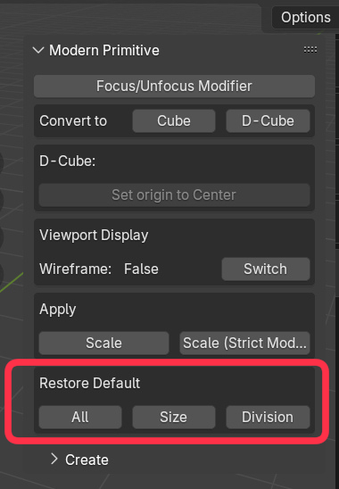
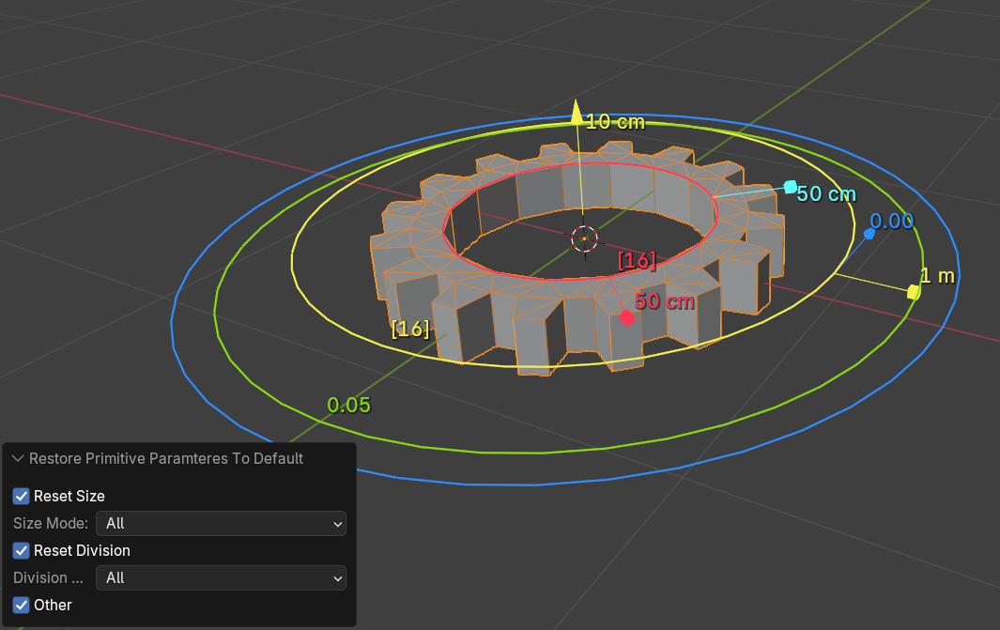

# Changelog
## v0.0.27
- added Pivot adjustment option

- added "Treat As Short" option to ConvertTo operator 
This is useful when switching flat cubes to torus

## v0.0.26
- ConvertTo(Primitive) operator: copy materials and modifiers from original object

## v0.0.25
- fixed an issue where the coordinates were not calculated correctly due to a memory release error in the ConvertTo(Primitive) operator

## v0.0.24
- fixed texture stretching in UV-Evenly mode when objects are scaled

## v0.0.23
- added "Select Base Axis" option to  ConvertTo(Primitive) Operator

## v0.0.22
- added Convert to (Grid, Sphere, Cylinder, Cone, Torus, Tube, Capsule) operators

Note: In the current implementation, the Z axis is Height and the XY axis is considered Width. In addition, the number of polygon splits remains in the initial setting.

## v0.0.21
- added Restore Default Parameters operator

## v0.0.20
- added Preferences panel

 

- Implemented a function to display gizmo values on the screen in real time

You can switch from the Gizmo menu.

## v0.0.19
- set the subtype of the parameter that specifies the size to "Distance"

## v0.0.18
- added UV-Coord Generation

Set the materials as usual. 
To specify uv coordinates, please specify the name specified in \"uv name\" in the shader attribute (default is "UVMap")

### UV coordinate generation type

- Simple
Generates uv coordinates according to a fixed rule regardless of the size of the primitive.

- Evenly (Slow)
Keep the texel density as constant as possible. As it says "slow", processing takes time. 
Please be careful about the number of polygon divisions when using this option.

## v0.0.17
- added "Smooth Shading" option

- added "Appropriate Size" option to MakePrimitive operator

Scales the primitive according to the distance from the viewpoint to the 3D cursor, keeping the apparent size constant.

## v0.0.16
- added "Apply Scaling" operator

If you scale a primitive, the size of the gizmo will no longer match the shape. In such cases, you can modify the size of the gizmo by applying a scale value.
The apply scaling operator has two modes. In strict mode, if the shape cannot be maintained by applying the scaling value, no processing is performed.
Normal mode allows the shape to change slightly.

For example, with a cylinder shape like the one below, the elliptical shape cannot be maintained when scaling values are applied, so an error will occur in strict mode.
Processing in normal mode preserves the shape as much as possible while setting the radius to a reasonable intermediate value.

## v0.0.15
- show object's wireframe when ModernPrimitive is active and selected

To change ModernPrimitive's Viewport Display property, use ModernPrimitive-Panel:
Use the button in the viewport display section of the modern primitive panel, or select a modifier other than the modern primitive modifier, cancel the wireframe display by the add-on, and set the object's viewport display checkbox as usual.

## v0.0.14
- Warning message when attempting to edit a ModernPrimitive mesh
- "Make ModernPrimitive" operators are valid only in OBJECT mode

## v0.0.13
- Added QuadSphere primitive

## v0.0.12
- Activate newly added primitive when added
- When append primitive, set 3d-cursor's rotation (as well as position)

- Added "Create" panel

## v0.0.11
- Changed Cube's initial dimension (X=2m, Y=2.19m, Z=2m) to (X=2m, Y=2m, Z=2m)
- Added panel UI to Tools tab

## v0.0.10
- Fixed an issue where other meshes would be affected when applying the ModernPrimitive modifier.
## v0.0.9
- fixed Tube and Gear's bottom region was invalid (flipped normals)
## v0.0.8
- changed polygon-division gizmo from "Linear" to "Dial"(Tube, Cylinder, Cube, Grid)
## v0.0.7a
- updated Tube primitive (side division)
## v0.0.7
- added Capsule primitive
## v0.0.6b
- update Cylinder, Tube ("centered" bool option)
- DeformableCube's "set origin to center" operator
## v0.0.6a
- added "Convert -> DeformableCube"
- fix some bugs... (convert function)
## v0.0.6
- added Deformable Cube primitive
- added "Convert -> ModernCube" function (and menu)
## v0.0.5a
- "Focus primitive" operator gets "disable_others" option, and Unfocus the primitive if already focused
## v0.0.5
- added Spring primitive
- fixed geometry distortion when bevel modifier is applied(Tube, Gear)
## v0.0.4
    added Gear primitive
## v0.0.3
    added [Select ModernPrimitive Modifier] Operator and Shortcut key(Ctrl+Alt+X)
## v0.0.2a
    fixed Tube primitive (bottom-region)
## v0.0.2
    added Tube primitive
## v0.0.1
    Initial Release
