# Modern Primitive
A Blender add-on for non-destructive modeling, providing 13 procedural primitives based on Geometry Nodes with interactive gizmos and a streamlined workflow.

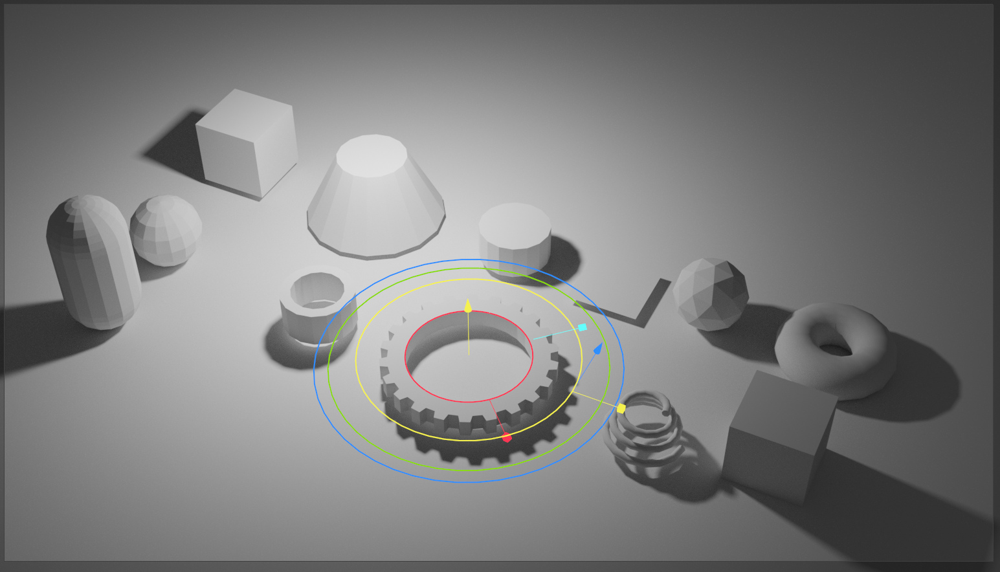 

<video controls src="https://github.com/user-attachments/assets/af1c5da9-1dcc-49d4-870b-7e9b7e9eb598" muted="false"></video>

## Features

### 13 Procedural Primitives
All primitives are built with Geometry Nodes, allowing for non-destructive editing at any time.
- **Cube / Deformable Cube**
- **UV Sphere / Ico Sphere / Quad Sphere**
- **Cylinder / Cone / Capsule / Tube**
- **Torus / Gear / Spring / Grid**

### Interactive Workflow
- **In-Viewport Gizmos**: Adjust parameters like radius, height, and divisions directly in the 3D view.
- **HUD (Heads-Up Display)**: Real-time display of parameter values and snapping information. Optionally show world-space values alongside local values when the object has non-uniform scale (configurable in Preferences → HUD, **disabled by default**).
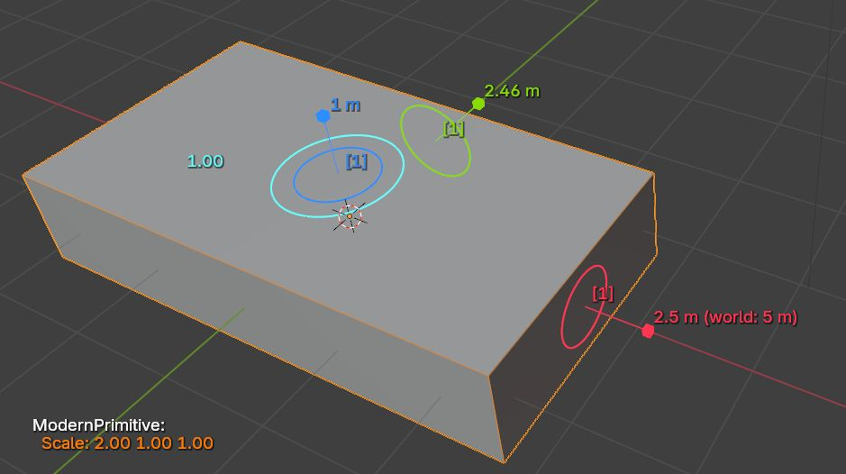
- **Modal Edit (`Ctrl + Shift + C`)**: Enter a modal mode to adjust parameters using keyboard shortcuts (e.g., `S` for Size, `H` for Height, `W` for Smooth), numeric input, and mouse wheel.
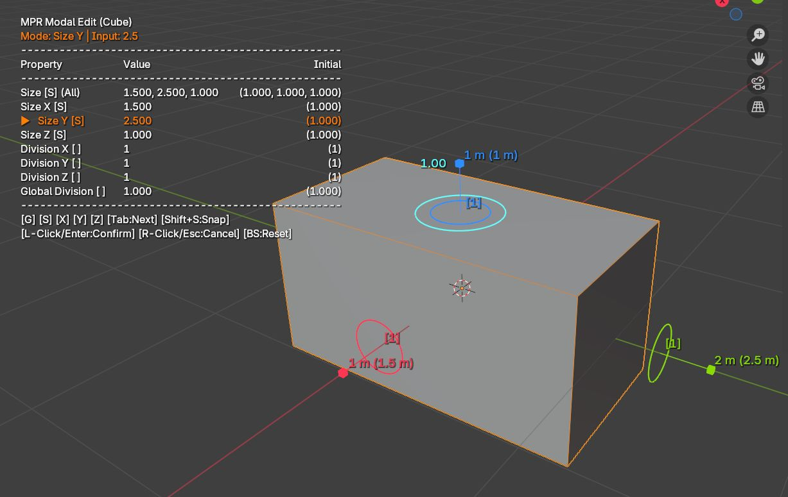
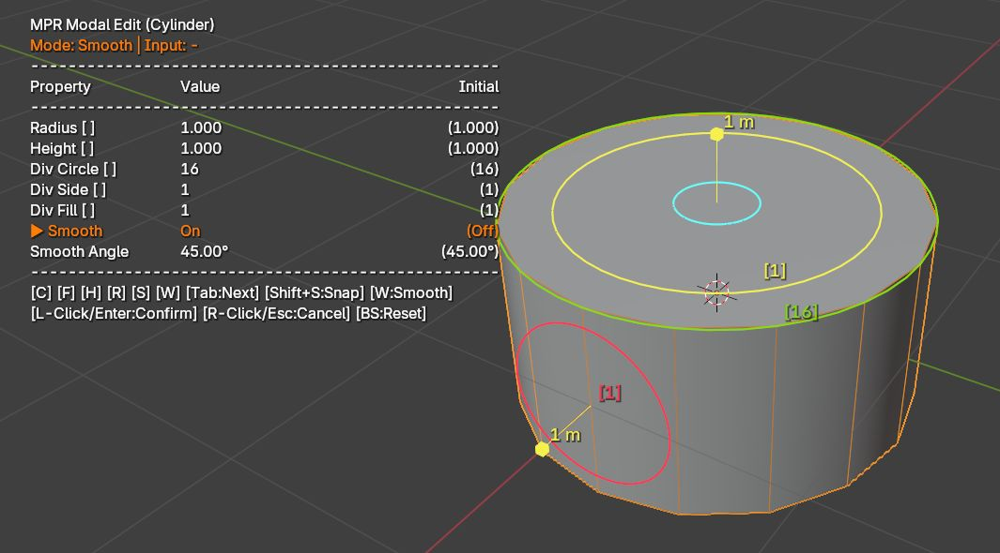
- **Focus Modifier (`Ctrl + Alt + X`)**: Instantly select and focus the Modern Primitive modifier for quick adjustments.
- **Snapping**: Precise control over primitive parameters with snapping support.

### Advanced Tools
- **Convert to Primitive**: Convert existing meshes into Modern Primitives. Reuses the original object to maintain Boolean relationships, materials, and modifiers.
- **Extract to Primitive**: Select polygons in Edit Mode and convert them into a new Modern Primitive object. Supports multi-region selection.
- **Origin Manipulation**: Move the object origin freely (using Blender's "Affect Only Origins") and reset it to the default position via the N-panel.
- **UV Generation**: Supports `Simple` and `Evenly` (texel density preserving) UV mapping. (Requires specifying the UV name in a Shader Attribute node, default is "UVMap")
- **Grid Material**: A procedural grid material for layout and UV checking. Parameters such as color, density, and line width can be adjusted directly from the MPR panel.
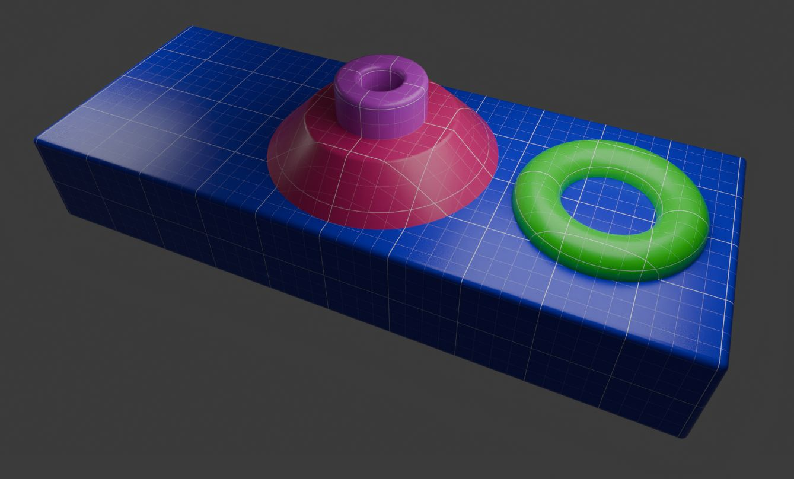
- **Apply Mesh**: Bake the procedural shape to a static mesh while optionally keeping the modifier for reference.
- **Apply Scale**: Synchronize gizmos with the object's scale.

## Requirement
- **Blender 4.3 or later**

## Usage

### 1. Creation
Add a Modern Primitive via the **Add Menu**:
`Shift + A` -> `Mesh` -> `Modern Primitive` -> (Select Shape)

You can also use the **MPR tab** in the N-panel for quick access.

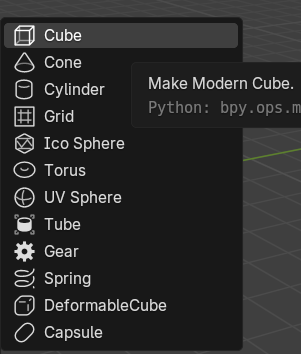

### 2. Adjustment
- **Modifier Properties**: Fine-tune all parameters in the Modifier tab.
- **Gizmos**: Use the interactive handles in the viewport.
- **N-Panel [MPR]**: Access extra tools like "Apply Mesh", "Restore Defaults", "Conversion" tools, and Grid Material settings.

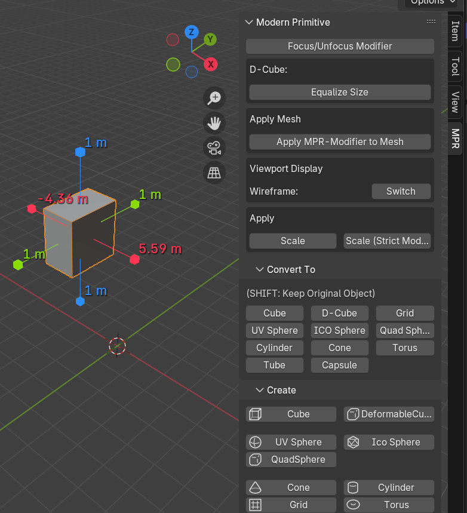

### 3. Shortcut
- **`Ctrl + Alt + X`**: Focus the Modern Primitive modifier. Pressing it again will unfocus/toggle.
- **`Ctrl + Shift + C`**: Start Modal Edit.

Keybindings can be viewed and restored from the **Preferences** panel.

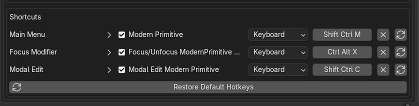

## Gallery
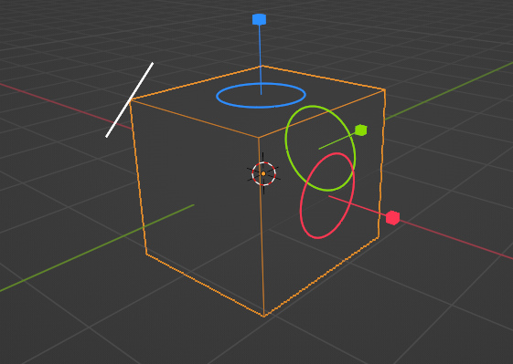 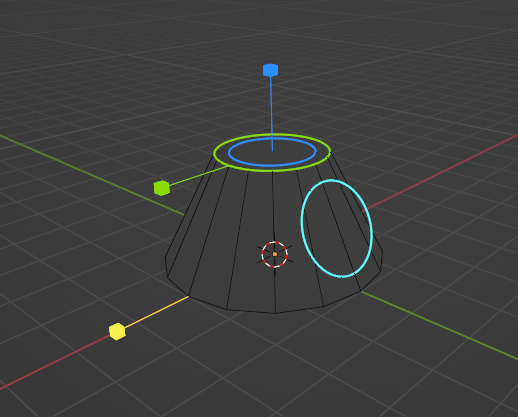 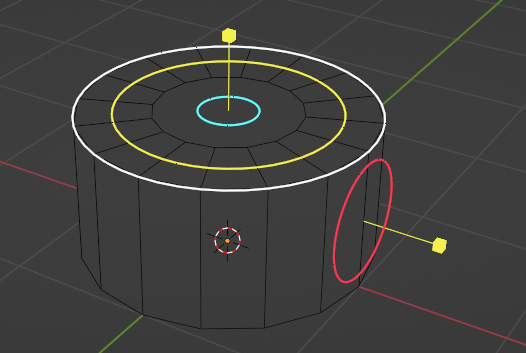 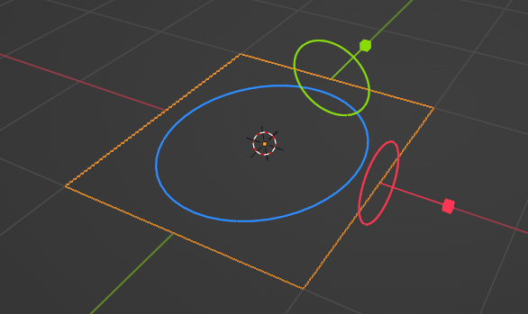
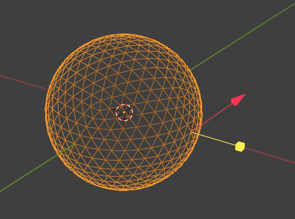 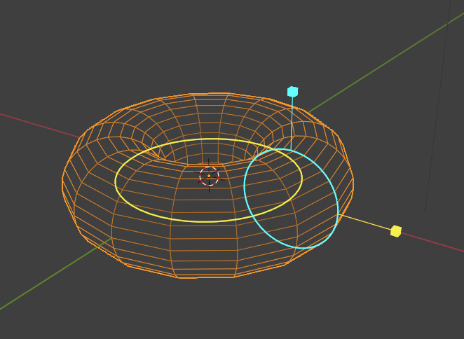 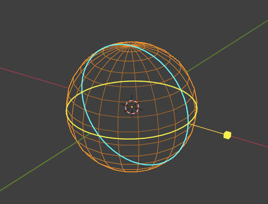 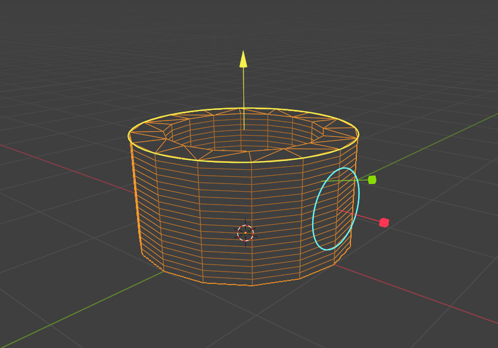
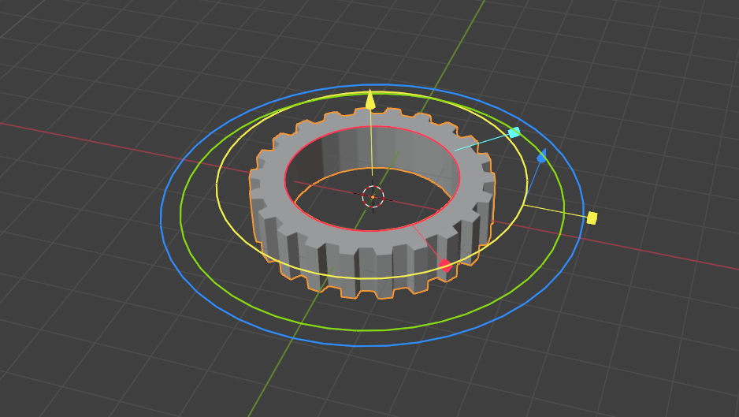 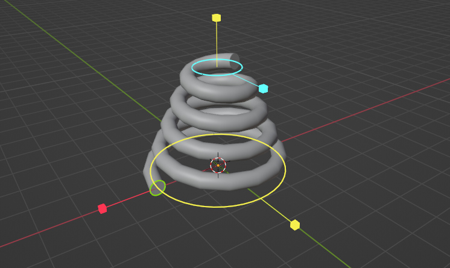 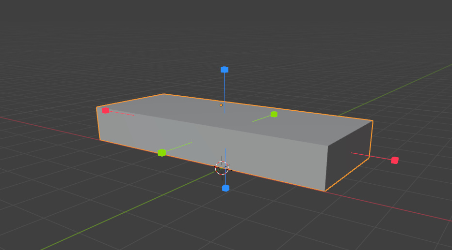 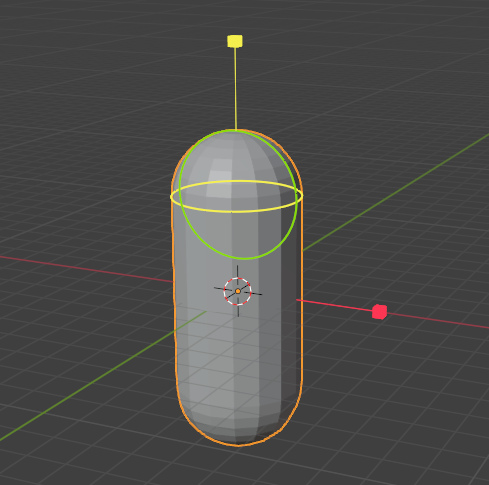

## Changelog
See [CHANGELOG.md](CHANGELOG.md) for full history.

## Author
Degarashi ([@degarashi](https://github.com/degarashi))
ps://github.com/degarashi))
