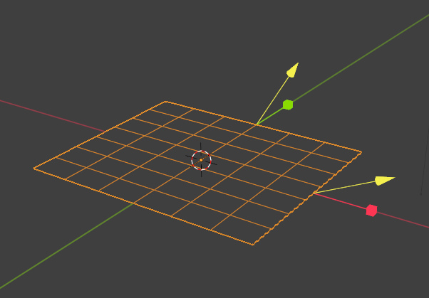

# ModernPrimitive
Modern Primitive Object for Blener
# Requirement
Blender 4.3 or later

# Usage
Add Object(Shift+A) -> Mesh -> ModernPrimitive
  
 
You can adjust from modifier panel. 

Shortcut key(Ctrl+Alt+X) to focus ModernPrimitive modifier (to manipulate primitive)

Convert To Cube function

DeformableCube's "set origin to center" operator

# Gallery
## Cube

## Cone

## Cylinder

## Grid

## Ico Sphere

## Torus

## UV Sphere

## Tube

## Gear

## Sprin

## DeformableCube

## Capsule

# Changelog
## v0.0.7a
- updated Tube primitive (side division)
## v0.0.7
- added Capsule primitive
## v0.0.6b
- update Cylinder, Tube ("centered" bool option)
- DeformableCube's "set origin to center" operator
## v0.0.6a
- added "Convert -> DeformableCube"
- fix some bugs... (convert function)
## v0.0.6
- added Deformable Cube primitive
- added "Convert -> ModernCube" function (and menu)
## v0.0.5a
- "Focus primitive" operator gets "disable_others" option, and Unfocus the primitive if already focused
## v0.0.5
- added Spring primitive
- fixed geometry distortion when bevel modifier is applied(Tube, Gear)
## v0.0.4
    added Gear primitive
## v0.0.3
    added [Select ModernPrimitive Modifier] Operator and Shortcut key(Ctrl+Alt+X)
## v0.0.2a
    fixed Tube primitive (bottom-region)
## v0.0.2
    added Tube primitive
## v0.0.1
    Initial Release

# Author
Degarashi
