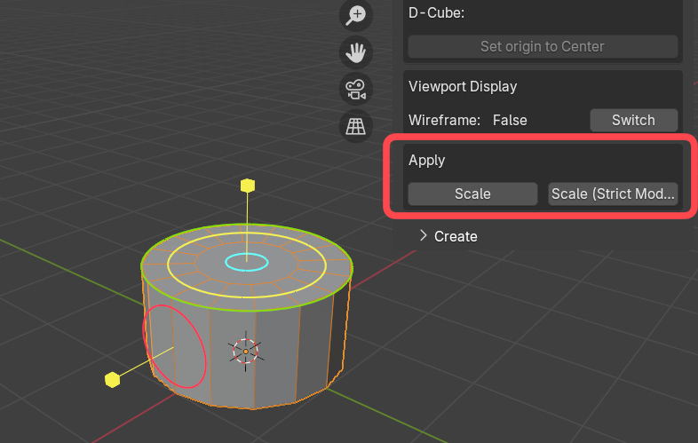
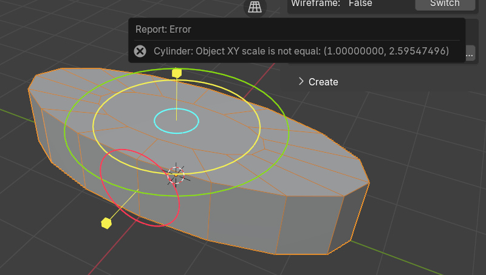
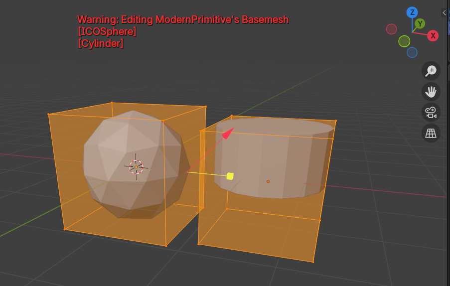
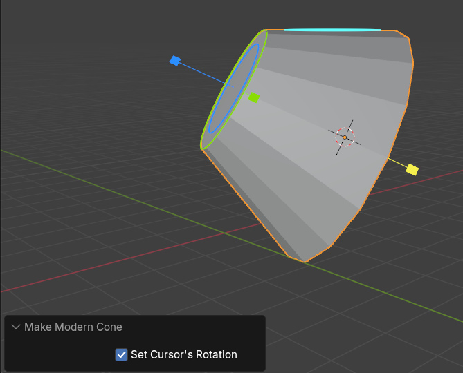
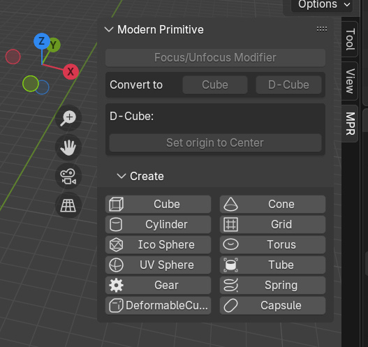

# ModernPrimitive
Modern Primitive Object for Blener 
 

<video controls src="https://github.com/user-attachments/assets/af1c5da9-1dcc-49d4-870b-7e9b7e9eb598" muted="false"></video>

# Requirement
Blender 4.3 or later

# Usage
Add Object(Shift+A) -> Mesh -> ModernPrimitive  
  
 
You can adjust from modifier panel. 

Shortcut key(Ctrl+Alt+X) to focus ModernPrimitive modifier (to manipulate primitive)

Convert To Cube function  

DeformableCube's "set origin to center" operator  

# Gallery
 

 
 
 

 

# Changelog
## v0.0.16
- added "Apply Scaling" operator
If you scale a primitive, the size of the gizmo will no longer match the shape. In such cases, you can modify the size of the gizmo by applying a scale value.
The apply scaling operator has two modes. In strict mode, if the shape cannot be maintained by applying the scaling value, no processing is performed.
Normal mode allows the shape to change slightly.

For example, with a cylinder shape like the one below, the elliptical shape cannot be maintained when scaling values are applied, so an error will occur in strict mode.
Processing in normal mode preserves the shape as much as possible while setting the radius to a reasonable intermediate value.

## v0.0.15
- show object's wireframe when ModernPrimitive is active and selected

To change ModernPrimitive's Viewport Display property, use ModernPrimitive-Panel:
Use the button in the viewport display section of the modern primitive panel, or select a modifier other than the modern primitive modifier, cancel the wireframe display by the add-on, and set the object's viewport display checkbox as usual.

## v0.0.14
- Warning message when attempting to edit a ModernPrimitive mesh
- "Make ModernPrimitive" operators are valid only in OBJECT mode

## v0.0.13
- Added QuadSphere primitive

## v0.0.12
- Activate newly added primitive when added
- When append primitive, set 3d-cursor's rotation (as well as position)

- Added "Create" panel

## v0.0.11
- Changed Cube's initial dimension (X=2m, Y=2.19m, Z=2m) to (X=2m, Y=2m, Z=2m)
- Added panel UI to Tools tab

## v0.0.10
- Fixed an issue where other meshes would be affected when applying the ModernPrimitive modifier.
## v0.0.9
- fixed Tube and Gear's bottom region was invalid (flipped normals)
## v0.0.8
- changed polygon-division gizmo from "Linear" to "Dial"(Tube, Cylinder, Cube, Grid)
## v0.0.7a
- updated Tube primitive (side division)
## v0.0.7
- added Capsule primitive
## v0.0.6b
- update Cylinder, Tube ("centered" bool option)
- DeformableCube's "set origin to center" operator
## v0.0.6a
- added "Convert -> DeformableCube"
- fix some bugs... (convert function)
## v0.0.6
- added Deformable Cube primitive
- added "Convert -> ModernCube" function (and menu)
## v0.0.5a
- "Focus primitive" operator gets "disable_others" option, and Unfocus the primitive if already focused
## v0.0.5
- added Spring primitive
- fixed geometry distortion when bevel modifier is applied(Tube, Gear)
## v0.0.4
    added Gear primitive
## v0.0.3
    added [Select ModernPrimitive Modifier] Operator and Shortcut key(Ctrl+Alt+X)
## v0.0.2a
    fixed Tube primitive (bottom-region)
## v0.0.2
    added Tube primitive
## v0.0.1
    Initial Release

# Author
Degarashi
