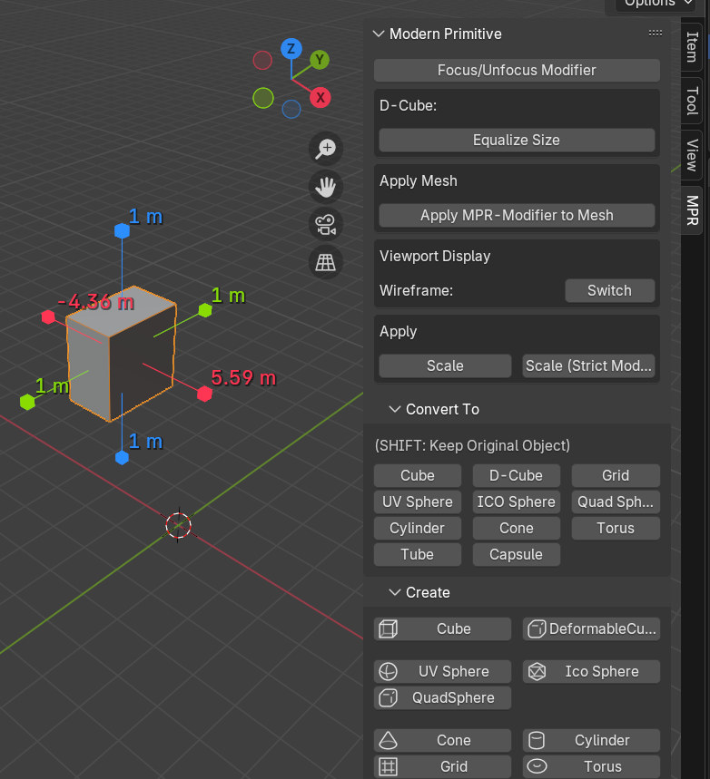

# ModernPrimitive
Modern Primitive Object for Blener 
 

<video controls src="https://github.com/user-attachments/assets/af1c5da9-1dcc-49d4-870b-7e9b7e9eb598" muted="false"></video>

# Requirement
Blender 4.3 or later

# Usage
Add Object(Shift+A) -> Mesh -> ModernPrimitive  
  
 
You can adjust from modifier panel. 

Shortcut key(Ctrl+Alt+X) to focus ModernPrimitive modifier (to manipulate primitive)

All functions are available on the [MPR] N-Panel

# Gallery
 

 
 
 

 

# Changelog
## v0.0.35
- Some refactorings.

- Fixed the part where the Blender API was being called from the rendering thread (the Blender API is originally intended to be accessed from the UI thread).

## Other
[<ins>View all log</ins>](CHANGELOG.md)

# Author
Degarashi
